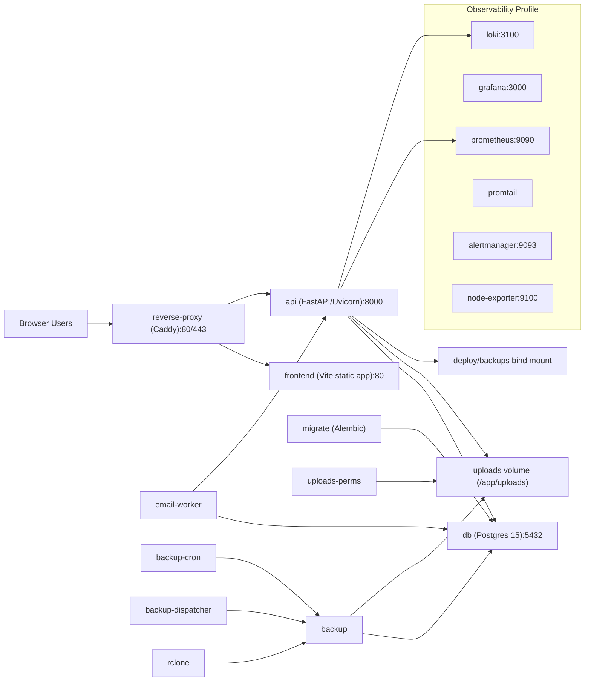

# Zen Ops Architecture Map

## System Diagram



## Service/Port/Dependency Map

| Service | Port | Depends on | Notes |
|---|---:|---|---|
| `reverse-proxy` | `80`,`443` | `api`,`frontend` | Entry point for browser/API traffic |
| `frontend` | container `80` | `api` | React/Vite app behind reverse proxy |
| `api` | container `8000` | `db`,`migrate`,`uploads-perms` | FastAPI app, `/readyz`, `/metrics` |
| `email-worker` | n/a | `db`,`migrate`,`uploads-perms` | Background notification/email worker |
| `migrate` | n/a | `db` | Runs `alembic upgrade head` |
| `uploads-perms` | n/a | n/a | Sets ownership on uploads volume |
| `db` | `5432` | n/a | Postgres named volume `postgres_data` |
| `backup` | n/a | `db` | Backup job container (profile `backup`) |
| `backup-cron` | n/a | `db` | Scheduled backup dispatcher |
| `backup-dispatcher` | n/a | `db` | Backup orchestrator |
| `rclone` | n/a | n/a | Remote backup transport |
| `prometheus` | `9090` | n/a | Metrics scrape (profile `observability`) |
| `grafana` | `3000` | n/a | Dashboards (profile `observability`) |
| `loki` | `3100` | n/a | Log storage (profile `observability`) |

## Backend Route Map

Mounted through `backend/app/modules/router_registry.py` into `backend/app/main.py`.

| Prefix | Source router |
|---|---|
| `/api/auth` | `backend/app/routers/auth.py` |
| `/api/auth/users` | `backend/app/routers/users.py` |
| `/api/assignments` | `backend/app/routers/assignments.py`, `assignment_metrics.py` |
| `/api/assignments/{assignment_id}/tasks` | `backend/app/routers/tasks.py` |
| `/api/tasks` | `backend/app/routers/tasks_overview.py` |
| `/api/assignments/{assignment_id}/messages` | `backend/app/routers/messages.py` |
| `/api/assignments/{assignment_id}/documents` | `backend/app/routers/documents.py` |
| `/api/document-comments` | `backend/app/routers/document_comments.py` |
| `/api/approvals` | `backend/app/routers/approvals.py` |
| `/api/leave` | `backend/app/routers/leave.py` |
| `/api/dashboard` | `backend/app/routers/dashboard.py` |
| `/api/master` | `backend/app/routers/master.py` |
| `/api/master/company-accounts` | `backend/app/routers/company.py` |
| `/api/master/document-templates` | `backend/app/routers/document_templates.py` |
| `/api/invoices` | `backend/app/routers/invoices.py` |
| `/api/activity` | `backend/app/routers/activity.py` |
| `/api/analytics` | `backend/app/routers/analytics.py` |
| `/api/backups` | `backend/app/routers/backups.py` |
| `/api/attendance` | `backend/app/routers/attendance.py` |
| `/api/payroll` | `backend/app/routers/payroll.py` |
| `/api/support` | `backend/app/routers/support.py` |
| `/api/client-logs` | `backend/app/routers/client_logs.py` |
| `/api/notifications` | `backend/app/routers/notifications.py` |
| `/api/partner` | `backend/app/routers/partner.py` |
| `/api/admin` | `backend/app/routers/partner_admin.py` |
| `/readyz`, `/healthz`, `/healthz/deps`, `/metrics`, `/version` | `backend/app/main.py` |

## Frontend Route Map

Declared in `frontend/src/App.jsx`.

| Area | Routes |
|---|---|
| Public | `/login`, `/partner/request-access` |
| Employee/Internal | `/account`, `/assignments`, `/assignments/new`, `/assignments/:id`, `/calendar`, `/notifications`, `/invoices`, `/requests` |
| Admin | `/admin/dashboard`, `/admin/workload`, `/admin/approvals`, `/admin/open-queue`, `/admin/activity`, `/admin/backups`, `/admin/analytics`, `/admin/personnel`, `/admin/partners/:id`, `/admin/masterdata`, `/admin/company`, `/admin/notification-deliveries`, `/admin/attendance`, `/admin/partner-requests`, `/admin/payroll`, `/admin/payroll/runs/:id`, `/admin/payroll/employees`, `/admin/payroll/reports`, `/admin/support`, `/admin/system-config` |
| Partner portal | `/partner`, `/partner/requests`, `/partner/requests/new`, `/partner/requests/:id`, `/partner/payments`, `/partner/notifications`, `/partner/profile`, `/partner/help` |

## Data Map (Major Entities)

Core entities are in `backend/app/models`.

| Domain | Major tables/entities | Key relationships |
|---|---|---|
| Auth/User | `users`, `revoked_tokens`, `idempotency_keys` | `users` links to assignments/tasks/messages/notifications/payroll data |
| Assignments | `assignments`, `assignment_assignees`, `assignment_floor_areas`, `assignment_tasks`, `assignment_messages`, `activity_logs` | Assignment has many documents/tasks/messages/activities/invoices/support threads/calendar events |
| Documents | `assignment_documents`, `document_comments`, `document_templates`, `document_checklist_templates` | Documents belong to assignment; comments belong to document+assignment+author |
| Invoicing | `invoices`, `invoice_items`, `invoice_payments`, `invoice_adjustments`, `invoice_tax_breakdowns`, `invoice_audit_logs`, `invoice_attachments` | Invoice belongs to assignment and creator; has many line-level child rows |
| Payroll | `payroll_runs`, `payroll_line_items`, `payslips`, `salary_structures`, `payroll_policies` | Payroll run has many line items and payslips; each linked to users |
| Partner | `external_partners`, `commission_requests`, `commission_request_documents`, `partner_requests`, `partner_request_attachments`, `partner_deliverables`, `partner_account_requests` | Partner owns partner requests and commission requests; assignment may map from commission request |
| Support | `support_threads`, `support_messages`, `support_tokens`, `email_delivery_logs`, `system_config` | Support thread optionally linked to assignment; messages belong to thread |
| Master data | `banks`, `branches`, `clients`, `property_types`, `property_subtypes`, `company_accounts`, `company_profiles`, `calendar_event_labels` | Referenced by assignments, invoices, templates, partner requests |
| Calendar/Leave | `calendar_events`, `leave_requests` | Leave request can attach to a calendar event |
| Notifications | `notifications`, `notification_deliveries`, `user_notification_prefs` | Notifications belong to users; deliveries track channel/status |

## Runtime Contracts

- OpenAPI export: `docs/openapi.json`
- Frontend/backend contract sweep: `docs/CONTRACT_REPORT.md`
- Drift checker script: `scripts/contract_check.py`

## Grafana Setup (Observability)

Bring observability stack up:

```bash
docker compose --profile observability up -d
```

Add datasources in Grafana (`http://localhost:3000`):

1. Prometheus:
   - URL: `http://prometheus:9090`
   - Access: Server (default inside compose network)
2. Loki:
   - URL: `http://loki:3100`
3. Postgres:
   - Host: `db:5432`
   - Database/User credentials from compose env
   - SSL mode: disable (internal network)

Recommended dashboards:

1. API errors:
   - `sum by (path,status) (rate(http_server_requests_total{status=~"4..|5.."}[5m]))`
2. API latency p95:
   - `histogram_quantile(0.95, sum(rate(http_server_request_duration_seconds_bucket[5m])) by (le,path))`
3. DB connections:
   - Postgres active/idle connections and transaction age panels.
4. Reverse-proxy errors:
   - Caddy/reverse-proxy 4xx/5xx by route and upstream.
