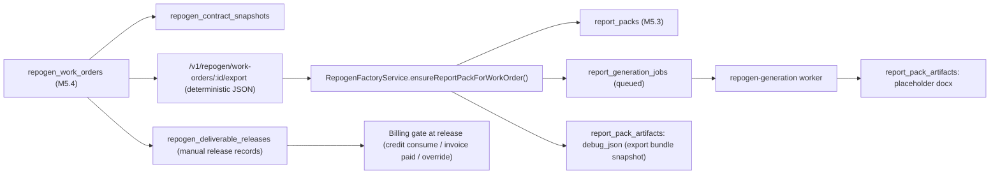

# Repogen Factory Flow (M5.5)

Last updated: 2026-02-24

## Scope

M5.5 bridges the M5.4 deterministic Repogen work-order spine to the M5.3 report pack/job pipeline without enabling real DOCX template rendering or OCR.

Factory flow in this milestone:

1. `repogen_work_orders` + snapshots/evidence/readiness (M5.4)
2. READY work order -> linked `report_packs` + `report_generation_jobs` (M5.3)
3. Worker creates placeholder artifact (still no template renderer)
4. Manual deliverables release click
5. Billing gate enforced at release (consume credit or require paid invoice / override)

## Non-Goals (Still Not Implemented)

- Real DOCX template rendering
- OCR extraction
- Bank template files or bank-specific paragraph blocks
- V1 DB writes / V1 subtree changes

## Bridge Model

## Linkage / Ownership Rules

- Primary authoritative link: `repogen_work_orders.report_pack_id`
- Convenience reverse link: `report_packs.work_order_id`
- DB uniqueness enforces one linked pack per work order in current M5.5 scope
- `repogen_deliverable_releases` stores release-time billing gate outcome and idempotency key for retry safety/audit

## Billing Gate Semantics (M5.5)

Acceptance (unchanged from M5.4):
- `DATA_PENDING` = factory accepted
- CREDIT mode: reserve 1 credit
- POSTPAID mode: create service invoice draft/issued flow (existing billing-control behavior)

Ready (unchanged from M5.4):
- `READY_FOR_RENDER` logs planned consumption usage event
- No credit consumption here

Release (new in M5.5, manual):
- `POST /v1/repogen/work-orders/:id/release-deliverables`
- CREDIT:
  - consumes reserved credit if reservation exists
  - blocks if missing reservation unless override is requested with reason
- POSTPAID:
  - requires linked service invoice `PAID`
  - blocks if unpaid/missing unless override is requested with reason
- All outcomes write:
  - `repogen_deliverable_releases`
  - billing usage event
  - report audit log (assignment-linked)

## Determinism Notes

- Factory bridge stores the deterministic export bundle in a `debug_json` artifact row (metadata-backed)
- Worker placeholder docx artifact metadata includes:
  - `work_order_id`
  - `snapshot_version`
  - `template_selector`
  - `export_bundle_hash`
- This lets operators confirm whether a pack corresponds to the latest snapshot state

## API Endpoints (M5.5 Additions)

- `POST /v1/repogen/work-orders/:id/create-pack`
  - creates/returns linked pack + queued generation job for READY work order
- `GET /v1/repogen/work-orders/:id/pack`
  - returns linked pack, generation job, artifacts, release records, billing gate summary
- `POST /v1/repogen/work-orders/:id/release-deliverables`
  - manual release with idempotency key, override option, billing gate enforcement

M5.4 endpoint behavior extended:
- `POST /v1/repogen/work-orders/:id/status`
  - when transitioning to `READY_FOR_RENDER`, auto-creates/links pack/job (no auto-release)

## Readiness / Factory Operator Checklist

1. Work order has computed snapshot and readiness score = 100.
2. Move status to `DATA_PENDING` (acceptance billing hook runs).
3. Move status to `READY_FOR_RENDER` (auto pack/job creation runs).
4. Confirm generation job completed and placeholder artifact exists.
5. Check billing gate:
   - CREDIT -> reservation present
   - POSTPAID -> invoice paid (or prepare override reason)
6. Manually release deliverables.

## Local Demo (curl / script)

Recommended:
- `scripts/demo-m5.5-repogen-factory.sh`

Manual curl flow summary:

1. Login web operator token (`/v1/auth/login`)
2. Create work order (`POST /v1/repogen/work-orders`)
3. Patch contract to create snapshots (`PATCH /v1/repogen/work-orders/:id/contract`)
4. Link at least 6 photo evidence metadata items (`POST /v1/repogen/work-orders/:id/evidence/link`)
5. Move to `DATA_PENDING` then `READY_FOR_RENDER`
6. Poll `GET /v1/repogen/work-orders/:id/pack` until job `completed`
7. Release deliverables (`POST /v1/repogen/work-orders/:id/release-deliverables`)
8. Verify export bundle (`GET /v1/repogen/work-orders/:id/export`) + artifacts in pack response

