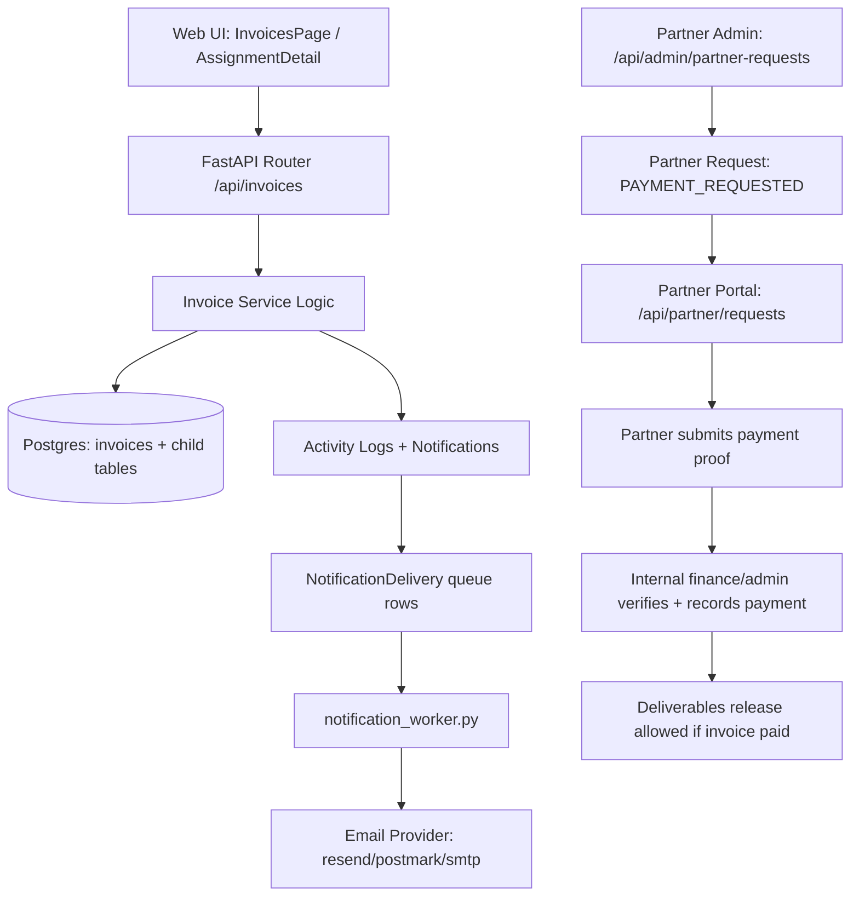

# V1 Billing & Invoicing: Top-to-Bottom Technical Report

## 1) Scope and Objective
This report explains exactly how billing and invoicing work in V1 (`/Users/dr.156/zen-ops`), from UI actions to API/service logic, DB writes, approvals, notifications, partner-side payment proof, and document release gating.

It is grounded in current code, primarily:
- `/Users/dr.156/zen-ops/backend/app/routers/invoices.py`
- `/Users/dr.156/zen-ops/backend/app/services/invoices.py`
- `/Users/dr.156/zen-ops/backend/app/models/invoice.py`
- `/Users/dr.156/zen-ops/backend/app/routers/approvals.py`
- `/Users/dr.156/zen-ops/backend/app/services/approvals.py`
- `/Users/dr.156/zen-ops/backend/app/routers/partner.py`
- `/Users/dr.156/zen-ops/backend/app/routers/partner_admin.py`
- `/Users/dr.156/zen-ops/frontend/src/pages/InvoicesPage.jsx`
- `/Users/dr.156/zen-ops/frontend/src/pages/AssignmentDetail.jsx`
- `/Users/dr.156/zen-ops/frontend/src/pages/partner/PartnerPayments.jsx`

## 2) High-Level Architecture (Billing Path)

## 3) Core Data Model (What Billing Stores)

### 3.1 Primary entities
- `invoices`
  - Parent billing record per assignment.
  - Key fields: `invoice_number`, `status`, `issued_date`, `due_date`, `subtotal`, `tax_amount`, `total_amount`, `amount_paid`, `amount_due`, `amount_credited`, `is_paid`, `paid_at`, party/billing snapshot fields, PDF metadata, void metadata.
- `invoice_items`
  - Line items with quantity, unit price, line total, optional tax code/rate/service code.
- `invoice_payments`
  - Payment rows (`amount`, `paid_at`, `mode`, reference, notes, creator).
- `invoice_adjustments`
  - Credits/discounts/write-offs.
- `invoice_tax_breakdowns`
  - CGST/SGST/IGST/CESS snapshot rows.
- `invoice_audit_logs`
  - Event-level mutation audit trail with `diff_json`.
- `invoice_attachments`
  - Invoice-linked files in uploads storage.
- `invoice_sequences`
  - Financial-year number sequence tracker (`financial_year`, `last_number`).
- `idempotency_keys`
  - Stores dedupe keys for side-effect endpoints.

### 3.2 Assignment linkage
Each invoice belongs to one assignment (`invoices.assignment_id`).
Assignment stores a top-level `is_paid` flag that is synced from invoice paid state in key payment paths.

## 4) Invoice Status Model and Transition Behavior

### 4.1 Status enum
- `DRAFT`
- `ISSUED`
- `SENT`
- `PARTIALLY_PAID`
- `PAID`
- `VOID`

### 4.2 How status changes
Status is mostly inferred from financial balance recalculation (`recompute_invoice_balance`):
- If not `DRAFT/VOID` and `amount_due <= 0` -> `PAID`
- Else if partial payment/credit exists -> `PARTIALLY_PAID`
- Else -> `SENT` if `sent_at` exists, otherwise `ISSUED`

Explicit transitions also occur via endpoints:
- `DRAFT -> ISSUED` via `/issue`
- `ISSUED -> SENT` via `/send`
- Any non-void + zero due via payment/mark-paid -> `PAID`
- Any eligible non-paid invoice -> `VOID` via `/void`

## 5) Internal Billing Workflow (End-to-End)

## 5.1 Invoice creation
Endpoint: `POST /api/invoices`

Steps:
1. Capability check: user must have `create_invoice` or `modify_money`.
2. Assignment access check (`ensure_assignment_access`).
3. Company profile fetch/auto-bootstrap.
4. Company account auto-selection logic:
   - preferred account if passed and active,
   - else bank-specific active primary,
   - else global primary,
   - else first active account.
5. Create invoice as `DRAFT` with assignment snapshot fields.
6. Line items:
   - Uses client payload items.
   - If empty and assignment has `fees`, auto-creates 1 fee line item.
7. Recompute canonical totals and balance server-side.
8. Write invoice audit log (`created`).
9. Write activity log (`INVOICE_CREATED`).
10. Notify assignment assignees (`PAYMENT_PENDING`).
11. Commit and return `InvoiceRead`.

## 5.2 Draft update
Endpoint: `PATCH /api/invoices/{invoice_id}`

Rules:
- Only allowed when status is `DRAFT`.
- Replaces items if provided.
- Recomputes totals/balance.
- Logs `edited` audit + `INVOICE_UPDATED` activity.

## 5.3 Issue invoice
Endpoint: `POST /api/invoices/{invoice_id}/issue`

Rules/behavior:
- Requires invoice create/modify capability.
- Only from `DRAFT`.
- Ensures snapshot integrity and default item fallback from assignment fees.
- Sets issued date (payload override optional).
- Generates invoice number if missing using FY sequence (`ZFYxx-00001`).
- Sets status `ISSUED`.
- Recomputes totals/balance.
- Creates tax breakdown snapshot.
- Logs `issued` audit + `INVOICE_ISSUED` activity.
- Notifies assignment assignees (`PAYMENT_PENDING`).

## 5.4 Mark as sent
Endpoint: `POST /api/invoices/{invoice_id}/send`

Behavior:
- Requires modify capability.
- Allowed from `ISSUED`, `SENT`, `PARTIALLY_PAID`.
- Sets `sent_at` timestamp.
- If status was `ISSUED`, switches to `SENT`.
- Logs `sent` audit + `INVOICE_SENT` activity.

Note: this is a status mutation; it does not itself transmit invoice email to client.

## 5.5 Record payment
Endpoint: `POST /api/invoices/{invoice_id}/payments`

Rules:
- Requires `modify_money` capability (`finance/admin`).
- Disallows payment on `VOID` and `DRAFT`.
- Amount must be positive, <= amount_due, and invoice not already settled.

Behavior:
- Inserts `invoice_payments` row.
- Recomputes balance (can become `PARTIALLY_PAID` or `PAID`).
- Logs `payment_recorded` audit + `INVOICE_PAYMENT_RECORDED` activity.
- If partner-linked invoice becomes paid for first time, notifies partner users (`PARTNER_PAYMENT_VERIFIED`).

## 5.6 Add adjustment
Endpoint: `POST /api/invoices/{invoice_id}/adjustments`

Rules:
- Requires modify capability.
- Disallows on `VOID` and `DRAFT`.
- Amount positive and <= invoice total.

Behavior:
- Inserts adjustment row.
- Recomputes balance.
- Logs `adjustment_added` audit + activity.

## 5.7 Mark paid (direct vs approval)
Endpoint: `POST /api/invoices/{invoice_id}/mark-paid`

Path A: user can modify money
- Creates one payment for full remaining due.
- Recomputes to paid.
- Writes payment audit and activity.
- Returns updated invoice.

Path B: user cannot modify money
- Creates approval request (`entity=INVOICE`, `action=MARK_PAID`, status `PENDING`).
- Routes to roles from approval routing (`FINANCE`, `ADMIN`).
- Notifies approver roles (`APPROVAL_PENDING`).
- Returns approval object.

Approval completion path:
- Approver hits `/api/approvals/{id}/approve`.
- `apply_approval_action` calls `mark_invoice_paid(...)` service.
- Service inserts manual payment for remaining due, recomputes invoice + syncs assignment `is_paid`, logs activity, and notifies finance/admin/ops.

## 5.8 Void invoice
Endpoint: `POST /api/invoices/{invoice_id}/void`

Rules:
- Requires modify capability + step-up auth dependency.
- Rejects if already void.
- Rejects if any paid amount exists (expects refund/credit workflow first).

Behavior:
- Status -> `VOID`, sets `voided_at`, `void_reason`, `voided_by_user_id`.
- Zeros `amount_due` and ensures not marked paid.
- Logs `voided` audit + `INVOICE_VOIDED` activity.

## 5.9 Reminder and overdue follow-ups
Endpoints:
- `POST /api/invoices/{invoice_id}/remind`
- `GET /api/invoices?create_followups=true&overdue_days=N`

Reminder controls:
- Permission: `modify_money` only.
- Blocks reminders for settled/void invoices.
- Supports `Idempotency-Key` header:
  - checks key-scope-user uniqueness,
  - request hash validation,
  - returns cached response on replay.
- Rate limits:
  - per user: max 10 reminders / 10 minutes,
  - per invoice dedupe: one reminder within 24h.
- On success:
  - creates `PAYMENT_PENDING` notifications to assignment assignees + finance/admin,
  - writes `INVOICE_REMINDER_SENT` activity,
  - stores idempotency response payload.

Follow-up task generation:
- Triggered through list endpoint parameter `create_followups=true`.
- Finds overdue unpaid invoices beyond threshold days.
- Creates `assignment_tasks` with `template_type=invoice_overdue` and due date +2 days.
- Uses DB unique partial index to avoid duplicate overdue task per invoice.
- Sends task notification and escalates 30+ day overdue to admin.

## 5.10 Invoice context, attachments, and PDF

Context endpoint (`GET /api/invoices/{id}/context`):
- Returns invoice + assignment billing context + company profile + selected company account.
- Can auto-correct invoice `company_account_id` to selected default.

Attachments:
- List: `GET /attachments`
- Upload: `POST /attachments/upload`
- Download: `GET /attachments/{id}/download`
- Delete: `DELETE /attachments/{id}` (destructive actions gate applied)

Storage:
- Files written under uploads directory: `uploads/invoices/{invoice_number or draft-id}/...`.

PDF generation (`GET /api/invoices/{id}/pdf`):
- Requires issued invoice number.
- Recomputes totals/balance before generate.
- Returns existing cached PDF unless `regenerate=true`.
- Uses ReportLab; writes PDF path and generated metadata on invoice.
- Logs `INVOICE_PDF_GENERATED` activity.

## 6) Invoicing API Surface

Primary router prefix: `/api/invoices`

Implemented endpoints:
- `GET /api/invoices`
- `GET /api/invoices/export.csv`
- `GET /api/invoices/{invoice_id}`
- `POST /api/invoices`
- `PATCH /api/invoices/{invoice_id}`
- `POST /api/invoices/{invoice_id}/issue`
- `POST /api/invoices/{invoice_id}/send`
- `POST /api/invoices/{invoice_id}/void`
- `POST /api/invoices/{invoice_id}/payments`
- `POST /api/invoices/{invoice_id}/adjustments`
- `POST /api/invoices/{invoice_id}/mark-paid`
- `POST /api/invoices/{invoice_id}/remind`
- `GET /api/invoices/{invoice_id}/context`
- `GET /api/invoices/{invoice_id}/attachments`
- `POST /api/invoices/{invoice_id}/attachments/upload`
- `GET /api/invoices/{invoice_id}/attachments/{attachment_id}/download`
- `DELETE /api/invoices/{invoice_id}/attachments/{attachment_id}`
- `GET /api/invoices/{invoice_id}/pdf`

## 7) RBAC and Access Control

Billing capabilities in V1 RBAC (`ROLE_CAPABILITIES`):
- `view_invoices`
- `create_invoice`
- `modify_invoice`
- `modify_money`

Role highlights:
- `ADMIN`: full billing capabilities including `modify_money`.
- `FINANCE`: full billing capabilities including `modify_money`.
- `OPS_MANAGER`: can create invoices but cannot modify money.
- `ASSISTANT_VALUER`, `FIELD_VALUER`, `EMPLOYEE`: no invoice capabilities.
- `EXTERNAL_PARTNER`: no internal invoice capabilities; partner-only routes.

Additional data scoping:
- Even with invoice capability, access is scoped through assignment visibility (`apply_access_filter`, `ensure_assignment_access`).

## 8) Partner-Side Payment and Invoice Flow

## 8.1 What partner can see
Partner API routes:
- `GET /api/partner/invoices` (only invoices where `invoice.partner_id == current_user.partner_id`)
- `GET /api/partner/invoices/{id}` (same scope)

Partner invoice schema includes:
- number, issued/due, status, totals, due amount, paid flag, paid timestamp.

## 8.2 Payment request and proof loop
Internal team creates partner request:
- `POST /api/admin/partner-requests` with `request_type=PAYMENT_REQUESTED`, entity assignment/invoice.
- Partner users are notified (`PARTNER_PAYMENT_REQUESTED`).

Partner submits proof:
- `POST /api/partner/requests/{id}/respond` (message) OR
- `POST /api/partner/requests/{id}/uploads` (file + optional message)
- Response request type maps to `PAYMENT_PROOF_SUBMITTED`.
- Internal finance/admin notified (`PARTNER_PAYMENT_PROOF_SUBMITTED`).

## 8.3 Unlocking deliverables
Deliverable release endpoint:
- `POST /api/admin/assignments/{assignment_id}/deliverables/release`

Hard gate:
- At least one invoice for assignment must be paid (`_ensure_invoice_paid`).
- Document must exist and be marked final.

Partner download endpoints also enforce payment verification before access.

## 9) Notification + Delivery Pipeline Around Billing

Billing events generate in-app notifications via `create_notification` / role fanout.
Each notification can enqueue delivery rows:
- `IN_APP` is marked sent immediately.
- `EMAIL` rows are queued `PENDING` if email rules match.
- WhatsApp is currently stubbed in V1 delivery service (logged, marked sent in stub path).

`notification_worker.py` processes queued email deliveries:
- Skips when email provider disabled/misconfigured.
- Applies retry limits and daily caps.
- Builds email content from templates.
- Sends via configured provider (`resend`, `postmark`, `smtp`).

## 10) Data Consistency and Safety Mechanisms

## 10.1 Canonical totals
All invoice totals and balances are recomputed server-side on mutation; frontend values are not authoritative.

## 10.2 Sequence concurrency safety
Invoice number generation uses row-level lock on `invoice_sequences` per financial year.

## 10.3 Idempotency for reminders
`idempotency_keys` unique constraint: `(key, scope, user_id)`.

## 10.4 Duplicate follow-up prevention
Unique partial index on `assignment_tasks(invoice_id)` where `template_type='invoice_overdue'`.

## 10.5 Auditability
- `invoice_audit_logs` for invoice mutation events.
- `activity_logs` for business timeline/audit across assignment and billing actions.

## 11) Frontend Behavior (Billing UX)

## 11.1 Internal invoices workbench (`InvoicesPage.jsx`)
Capabilities:
- Ledger list with advanced filters, sorting, pagination.
- Aging and overdue stats.
- Saved views and column preferences in localStorage.
- Create invoice drawer.
- Bulk operations:
  - bulk reminders (max 10 per run)
  - bulk selected export
  - bulk mark-paid (handles approval-required responses).
- Detail drawer tabs: summary, payments, adjustments, attachments, audit.

## 11.2 Assignment detail finance tab (`AssignmentDetail.jsx`)
Capabilities:
- Inline invoice create for assignment.
- Issue, mark paid, generate/download PDF from assignment page.
- Displays invoice table and payment state tied to the assignment.

## 11.3 Partner payments (`PartnerPayments.jsx`)
Capabilities:
- Lists partner-scoped invoices.
- Shows unpaid counters.
- Shows open payment requests.
- Allows payment proof submission via message and/or file upload.

## 12) DB Migration History Relevant to Billing

- `0008_invoice_followups_and_idempotency`
  - Adds `idempotency_keys`.
  - Adds `assignment_tasks.invoice_id` + unique overdue follow-up index.
- `0011_invoice_overhaul`
  - Adds payment/adjustment/tax/audit/attachment/sequence tables.
  - Expands invoice fields (currency, due/paid/credit, billing snapshot, void metadata).
- `0012_backfill_invoice_totals`
  - Backfills totals and statuses using canonical recompute logic.

## 13) Test Coverage Observed

### 13.1 `backend/tests/test_invoices.py`
Covers:
- Invoice list includes totals.
- Payment updates amount_due to zero and status to `PAID`.
- Reminder dedupe blocks repeated reminder quickly.
- CSV export endpoint returns invoice CSV.

### 13.2 `backend/tests/test_partner_portal.py`
Covers:
- Partner role blocked from internal routes.
- Partner invoice access is partner-scoped (other partner gets 404).
- Basic partner commission submit path.

## 14) Operational Configs That Affect Billing Behavior

From settings/env:
- `EMAIL_PROVIDER`, `EMAIL_FROM`, `EMAIL_API_KEY`, SMTP vars.
- `EMAIL_MAX_ATTEMPTS`, `EMAIL_RETRY_MINUTES`, `EMAIL_DEDUPE_MINUTES`, `EMAIL_DAILY_LIMIT`.
- `UPLOADS_DIR` for invoice PDF/attachments.
- `ALLOW_DESTRUCTIVE_ACTIONS` impacts delete attachment in production contexts.

## 15) End-to-End Sequence Examples

## 15.1 Standard internal billing lifecycle
1. Ops/Admin creates assignment.
2. Invoice draft created (`POST /api/invoices`).
3. Invoice issued (number assigned).
4. Invoice marked sent.
5. Finance records payment (or ops requests mark-paid approval).
6. Invoice auto-transitions to paid when due reaches zero.
7. Activity + notifications emitted at each critical step.

## 15.2 Partner-linked payment proof lifecycle
1. Internal team raises payment request to partner (`/api/admin/partner-requests`).
2. Partner views invoice and payment request in portal.
3. Partner submits payment proof (message/file).
4. Finance verifies and records payment on invoice.
5. System flags paid; partner payment-verified notification can be sent.
6. Final deliverables become downloadable once paid gate passes.

## 16) Observed Gaps / Design Notes (Important)

1. `send` endpoint is status-only.
- `POST /api/invoices/{id}/send` marks invoice as sent but does not directly email client invoice documents.

2. Direct `mark-paid` path and approval-applied `mark-paid` are not identical side-effect-wise.
- Direct route logs activity and audit.
- Approval path uses service function that also notifies roles and syncs assignment state.

3. Invoice status is partially inferred, not strict finite-state machine.
- Practical and simple for current internal use, but no explicit transition guard framework beyond endpoint checks.

4. Reminder idempotency scope is endpoint-specific.
- Robust for reminders, but idempotency is not centralized middleware for all mutating billing endpoints.

5. Attachment storage is local filesystem.
- Works for single-node deployment; distributed/storage abstraction is a future scale consideration.

## 17) Practical Summary
V1 billing is a real operational subsystem, not just a placeholder:
- Server-authoritative totals and balance logic.
- Financial-year invoice numbering with DB lock safety.
- Payment/adjustment ledger rows and audit trail.
- Role-gated money operations with approval fallback for non-finance users.
- Reminder dedupe + rate limiting + overdue follow-up automation.
- Partner-side invoice visibility and payment-proof workflow tied to deliverable release.

For future migration planning, V1 already has a clear domain split you can map into V2 modules: invoice core, money mutation controls, reminders/followups, partner payment proof, and audit/notification surfaces.
